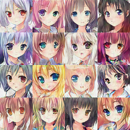
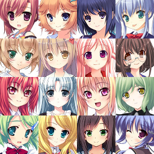

# Anime Face Generation
Implementation of Deep Convolution GAN to generate Anime Faces :heart:

Below are the pictures of characters generated by our model (**left**) and some images from the training data (**right**).  

&nbsp;&nbsp;&nbsp;&nbsp;&nbsp;&nbsp;&nbsp;&nbsp;&nbsp;&nbsp;&nbsp;&nbsp;&nbsp;&nbsp;&nbsp;&nbsp;&nbsp;&nbsp;&nbsp;&nbsp;&nbsp;&nbsp;  

The model has been trained for 100 epochs and can be trained for more to obtain slightly better results. The `Discriminator.pth` and `Generator.pth` is included if one plans to continue the training of the model.

To generate the character images of resolution 64\*64 (I know this is too low), one can use `generate.py` with the arguments:
>`--path`: (Optional) Specify the path where you want to save the images.  
>`--num_images`: Number of images of Characters you want to generate.

The model can be trained using `main.py` and below are the arguments accepted by the script:  
>`--dataset`: Specify the location of the dataset to train the model.  
>`--epoch`: The number of epochs to train the model.  
>`--device`: (Optional: *default CPU*) The device on which the model is to be trained.  
>`--continue`: (Optional: *default False*) Set this as **True** if you want continue training the model.  
>`--seed`: (Optional) Set the value of seed manually to reproduce the results for an experiment.

The dataset which is used for this fun project was [Anime Faces](https://www.kaggle.com/soumikrakshit/anime-faces)  

Thanks to *GAN hacks by Soumith Chintala* (The repo can be found [here](https://www.github.com/soumith/ganhacks)) which made it much easier to train the model and help me learn many things.  

Also to Aladdin Persson's [YouTube Channel](https://www.youtube.com/channel/UCkzW5JSFwvKRjXABI-UTAkQ) which helped me to learn implement the code.
